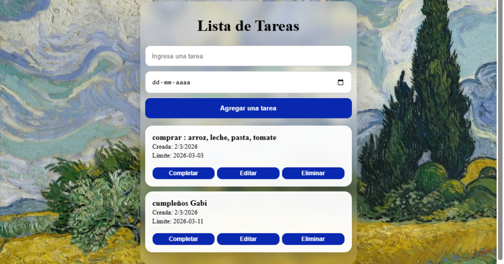

# 📸 Vista previa de la aplicación

  

#  Lista de Tareas

Aplicación web desarrollada con HTML, CSS y JavaScript para gestionar tareas de manera sencilla e interactiva.

##  Funcionalidades

- Crear nuevas tareas con fecha límite
- Editar tareas existentes
- Eliminar tareas
- Marcar tareas como completadas
- Guardado automático en localStorage
- Simulación de envío a API externa

##  Tecnologías utilizadas

- HTML5
- CSS
- JavaScript (ES6)
- Programación Orientada a Objetos
- LocalStorage
- Fetch API

##  Cómo ejecutar el proyecto

1. Clonar o descargar el repositorio
2. Abrir el archivo `index.html` en el navegador
3. Comenzar a agregar tareas

Proyecto académico de práctica en JavaScript.